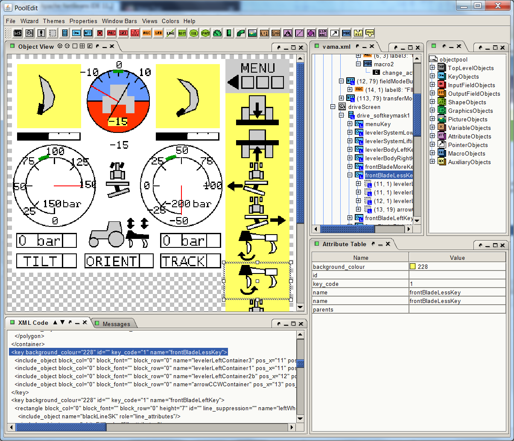

# PoolEdit 

(distributable for users, developers should check out the
[source](https://github.com/moehman/PoolEditSrc) package)

---

PoolEdit is a graphical user interface (GUI) editor for creating
ISOBUS object pools in XML format. In the ISO 11783 standard, the term
_object pool_ refers to the collection of graphical user interface
objects that makes up the GUI. This is a tool for editing ISOBUS user
interfaces i.e. object pools, hence the name PoolEdit.

As the standard defines only a binary format, a second tool called
[PoolEditParser](https://github.com/moehman/PoolEditParser) is used to
read the XML files and write binary ISOBUS object pools.

The editor uses XML format internally as an editable data structure
and externally as a file format. The PoolEdit XML format is based on
the IsoAgLib format with some minor changes.

Please read the manual for more information!

Current development environment:
* OS: Windows 7 (but should work on Windows 10 as well)
* IDE: NetBeans 11.2
* Java: jdk-13.0.1
